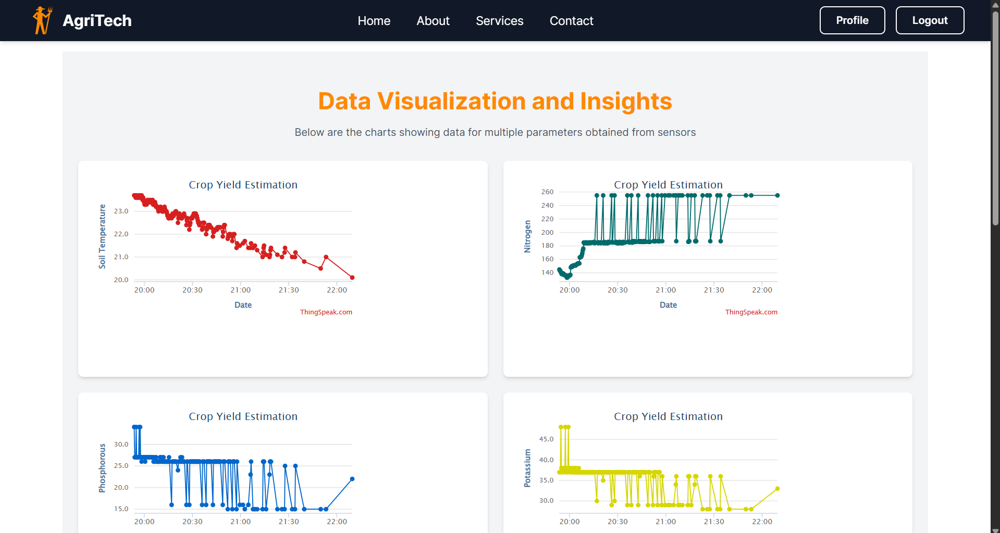
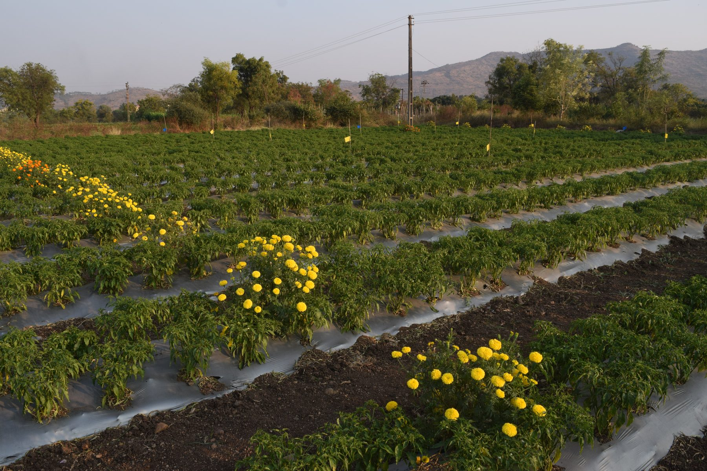
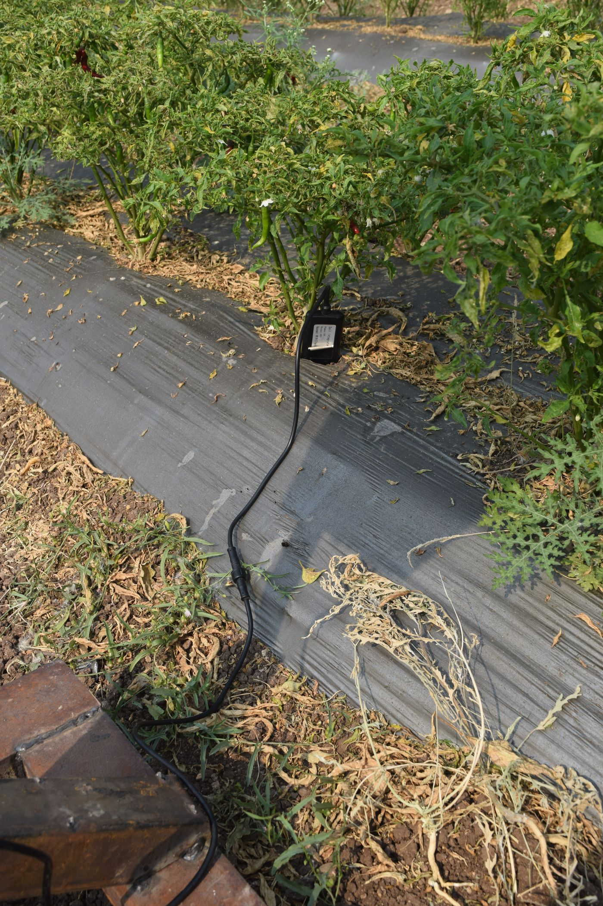

# AgriTech

**An AI-driven system for crop health management and yield estimation, built on a solar-powered IoT sensor network.**

    

A final-year engineering project that put a solar-powered sensor node in a working chilli field, streamed soil and climate readings to the cloud, and ran three machine-learning models over them — recommending crops, estimating yield, and diagnosing leaf disease from a photograph.

<p align="center">
  
  <br>
  <em>The deployed node: 10 W panel, ESP32 and battery in a weatherproof enclosure, standing in the chilli rows.</em>
</p>

> **Project status: archived.** Built in 2024–25 at Pune Institute of Computer Technology. The hardware has since been decommissioned and the ThingSpeak channel retired, so the system is no longer live. This repository documents what was built, how it worked, and how well it performed.

---

## What it does

Three independent models, each answering a different question a farmer actually asks:

| Module | Question | Inputs | Model | Result |
|---|---|---|---|---|
| **Crop recommendation** | What should I plant here? | N, P, K, temperature, humidity | Random Forest | 96.42% accuracy, top-3 with confidence |
| **Yield prediction** | How much will I get? | 7 soil + climate channels | K-Nearest Neighbors | R² 0.975 — *on a simulated target, see [Results](#results)* |
| **Disease detection** | What's wrong with this plant? | Photograph of a chilli leaf | Vision Transformer | 94% across 5 classes |

---

## How it worked


The data path, end to end:

```
7-in-1 NPK probe ─┐
                  ├─► ESP32 ──Wi-Fi──► ThingSpeak ──► Flask API ──► React app
DHT11 sensor ─────┘   (RS485)          (cloud)        (3 models)     (browser)
     ▲
     └── 10 W solar panel → charge controller → 18650 pack
```

A 7-in-1 soil probe reported nitrogen, phosphorus, potassium, moisture and soil temperature over RS485; a DHT11 added air temperature and humidity. An ESP32 polled both, pushed readings to ThingSpeak over Wi-Fi, and ran entirely off a 10 W solar panel through a charge controller and an 18650 battery pack. A Flask service loaded the three trained models and served predictions to a React frontend.

Readings landed in ThingSpeak, which gave a live view of the field while the node was deployed:

<p align="center">
  
  <br>
  <em>The live dashboard during deployment — soil temperature, nutrients, moisture and humidity. The channel has since been retired.</em>
</p>

📄 **[Full architecture documentation →](docs/architecture.md)** — DFDs, ER diagram, sequence and activity diagrams.

---

## The field

<p align="center">
  
  <br>
  <em>The deployment site: chilli under plastic mulch, with a marigold trap crop along the border.</em>
</p>

## The hardware

<table>
<tr>
<td width="50%"></td>
<td width="50%"></td>
</tr>
<tr>
<td><em>Inside the enclosure: solar charge controller, 18650 pack, and a hand-soldered board carrying the ESP32, buck converter and RS485 transceiver.</em></td>
<td><em>The 7-in-1 probe in a mulched bed beside fruiting chilli plants.</em></td>
</tr>
</table>

| Component | Role |
|---|---|
| ESP32 DevKit | Reads sensors, pushes to ThingSpeak over Wi-Fi |
| 7-in-1 NPK probe (RS485) | N, P, K, moisture, soil temperature |
| DHT11 | Air temperature and humidity |
| MAX485 transceiver | TTL ↔ RS485 for the Modbus probe |
| LM2596 buck converter | Battery voltage → 5 V logic |
| PWM solar charge controller | Panel → battery management |
| 10 W panel + 18650 pack | Off-grid power |
| Weatherproof enclosure | Pole-mounted, field-serviceable |

🔌 **[Full hardware documentation →](docs/hardware.md)** — wiring, Modbus register map, ThingSpeak field mapping, and the firmware.

---

## Results

All three modules were benchmarked against alternative algorithms. **The caveats below each table are as important as the numbers** — please read them.

### Crop recommendation

| Model | Accuracy |
|---|---|
| **Random Forest** | **96.42%** |
| Gaussian Naive Bayes | 96.02% |
| Decision Tree | 94.37% |
| K-Nearest Neighbors | 94.20% |
| SVC | 88.41% |
| Logistic Regression | 84.51% |

2,934 samples across 23 crops. Random Forest was deployed, returning the top 3 crops with confidence scores.

> ⚠️ **Caveat — class imbalance.** Chilli accounts for 734 of the 2,934 rows (25%) because our own field readings were appended to a public 22-crop dataset that has 100 rows per crop. Accuracy on the remaining 22 crops is therefore weaker than the headline figure suggests.

### Yield prediction

| Model | R² (%) |
|---|---|
| **K-Nearest Neighbors** | **97.53%** |
| Gradient Boosting | 97.48% |
| Random Forest | 97.26% |
| Linear Regression | 92.50% |
| MLP Regressor | 78.00% |
| SVR | 66.21% |

> ⚠️ **Caveat — the target variable is simulated, and this number should not be read as real-world yield accuracy.**
>
> The 734 sensor readings are genuine field measurements. The yield labels are not: no ground-truth harvest data was collected, so the target was generated from the sensor columns using a hand-specified linear formula with added noise:
>
> ```python
> yield = 3200 + 2·soil_temp − 1.5·N + 3·P + 3·K
>              + 1.2·moisture − 2·humidity + 2·air_temp + 𝒩(0, 15)
> ```
>
> Every regressor scoring above 97% is the tell: the models are recovering a function that was handed to them. What this module actually demonstrates is a working sensor-to-prediction pipeline, not validated agronomy. Measuring real harvest yields is the single most important piece of future work.

### Disease detection

| Model | Accuracy |
|---|---|
| **Vision Transformer (ViT-Base)** | **94.00%** |
| MobileNetV2 | 78.00% |
| EfficientNet | 68.00% |
| ResNet50 | 64.00% |

`google/vit-base-patch16-224-in21k` fine-tuned for 5 epochs over 1,150 training images across five classes — healthy, leaf curl, leaf spot, whitefly, yellowish.

| Class | Precision | Recall | F1 |
|---|---|---|---|
| healthy | 1.00 | 0.80 | 0.89 |
| leaf curl | 0.77 | 1.00 | 0.87 |
| leaf spot | 1.00 | 1.00 | 1.00 |
| whitefly | 1.00 | 1.00 | 1.00 |
| yellowish | 1.00 | 0.90 | 0.95 |

> ⚠️ **Caveat — small test set.** 94% is 47 of 50 held-out images (10 per class). A single reclassification moves the figure by two points, so treat it as indicative rather than precise. The confusion is concentrated in healthy leaves being read as leaf curl.

📊 **[Full model documentation →](docs/models.md)** — datasets, features, preprocessing and methodology.

---

## The web application

<table>
<tr>
<td width="50%"></td>
<td width="50%"></td>
</tr>
<tr>
<td align="center"><em>Yield prediction</em></td>
<td align="center"><em>Crop recommendation</em></td>
</tr>
</table>

A React frontend with Firebase authentication, talking to a Flask API over three endpoints:

| Endpoint | Method | Returns |
|---|---|---|
| `/predict_yield` | POST | Estimated yield in kg/acre |
| `/predict_crop` | POST | Top 3 crops with confidence |
| `/predict_disease` | POST | Disease class from an uploaded image |

🔗 **[API reference →](docs/api.md)**

---

## Repository layout

```
├── backend/          Flask inference API
├── frontend/         React application
├── ml/
│   ├── notebooks/    Training and evaluation notebooks
│   └── data/         Datasets (CSV, XLSX)
├── models/           Trained scikit-learn models
├── docs/             Documentation and images
└── report/           Full project report (PDF)
```

### Large files

Three assets are too large for this repository and live on Google Drive:

| Asset | Size | Link |
|---|---|---|
| Trained ViT weights (`disease_model.pth`) | 343 MB | [Download](https://drive.google.com/file/d/14-23-b4YtxMpg_rnom65whN3rbz6rsCI/view) |
| Chilli leaf image dataset | 69 MB | [Download](https://drive.google.com/drive/folders/1HrhfqsVodF_xJw6OT49loYei_nRlDOTd) |
| ESP32 firmware | — | [View](https://docs.google.com/document/d/1QhVWsExaii1ppKIEPD_oWN_gtc14UCqahXl2J7_BAZU/edit) |

📦 **[Details and checksums →](docs/DATA.md)**

---

## Running it

The project is archived and no longer deployed — the sensor hardware is decommissioned and the ThingSpeak channel is retired, so the live-data features cannot function. The prediction endpoints still work offline if you want to try them:

```bash
# Backend — needs Python 3.12 and scikit-learn 1.6.1 exactly,
# since the pickled models will not load on a different version.
cd backend
pip install -r requirements.txt
python app.py          # serves on :5001

# Frontend
cd frontend
npm install
npm run start-react    # serves on :3000
```

Disease detection additionally requires `disease_model.pth` from the Drive link above, placed in `models/`.

---

## Limitations

Stated plainly, because they shape how the results should be read:

- **Yield labels are simulated,** not measured. See the caveat above — this is the most significant limitation.
- **Disease detection is chilli-only,** across five conditions, evaluated on 50 images.
- **Soil temperature was derived,** not measured: the firmware computed it as air temperature − 5 °C, since the probe's temperature channel was not wired through.
- **The recommendation dataset is chilli-heavy,** at 25% of all rows.
- **Connectivity was required.** The node had no offline buffering; readings taken without Wi-Fi were lost.
- **Single-site deployment.** All field data comes from one plot, so nothing here is validated across soil types or agro-climatic zones.

## Future work

From the original report, plus what we learned since:

- Collect real harvest yields to replace the simulated target
- Extend beyond chilli to maize, rice and wheat
- Buffer readings locally so the node survives connectivity gaps
- Add automated irrigation control driven by soil moisture
- Compress the ViT for on-device inference at the edge
- Voice-based interaction in regional languages

---

## Team

Built for the Bachelor of Engineering (Computer Engineering) degree at **Pune Institute of Computer Technology**, Savitribai Phule Pune University, 2024–25.

- **Advait Naik** — [@Advait0801](https://github.com/Advait0801)
- **Kaustubh Netke**
- **Rhea Shah**
- **Vineet Kothari**

Guided by **Dr. S. S. Sonawane**, Department of Computer Engineering.

### Publications and reports

- 📕 **[Full project report](report/BE_Project_Report.pdf)** (PDF, 27 pp.) — literature survey, system design, testing and results.
- 📄 **[*Precision Agriculture: A Survey of Techniques*](report/Precision_Agriculture_Survey_Paper.pdf)** (PDF, 7 pp.) — the survey paper published from this work, covering variable-rate technology, vertical farming, UAV- and sensor-based crop health monitoring, and a comparison of ML algorithms for yield prediction.

## License

[MIT](LICENSE)
