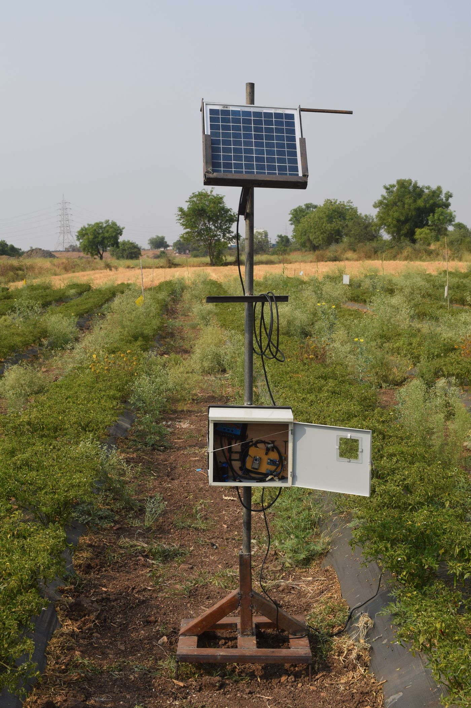
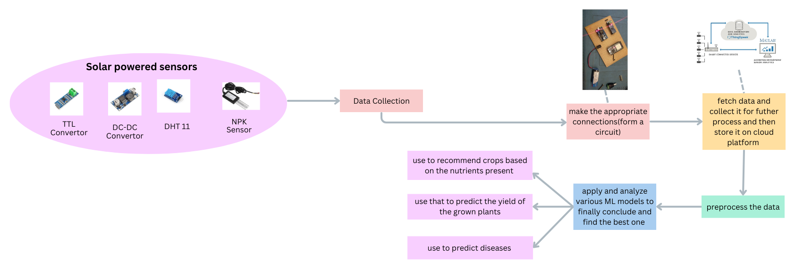
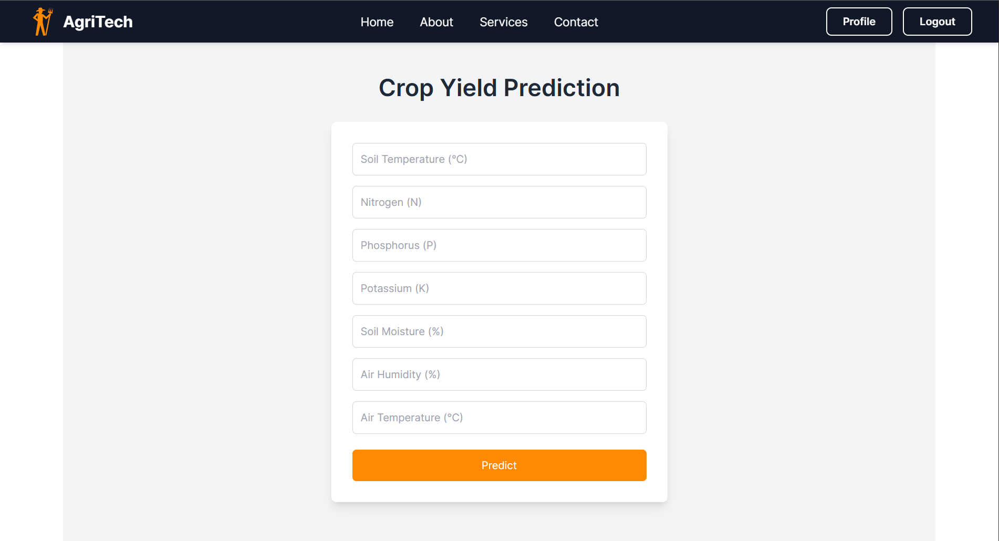
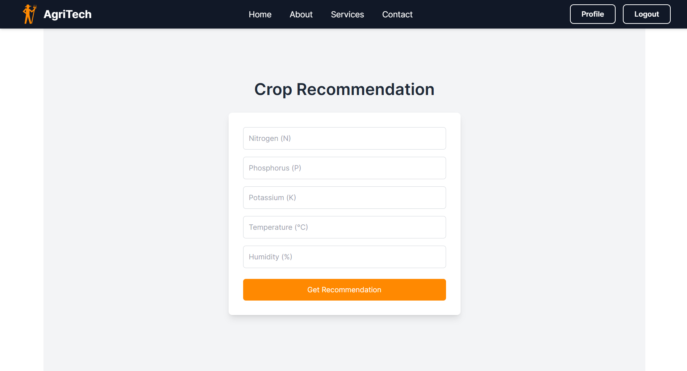
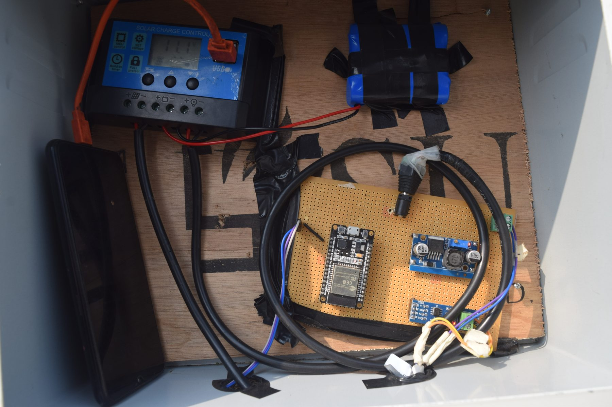

<h1 align="center">AgriTech</h1>

<p align="center">
  <strong>Precision agriculture platform — a solar-powered IoT sensor node feeding three ML models for crop recommendation, yield estimation and disease detection.</strong>
</p>

<p align="center">
  
  
  
  
  
  
  
</p>

<p align="center">
  
</p>

A sensor node built, deployed and left running in a working chilli field: a 7-in-1 soil probe and DHT11 on an ESP32, powered entirely by a 10 W solar panel, streaming nutrient and climate readings to the cloud. Three models turn those readings into decisions, served through a Flask API and a React frontend.

> **Archived** — built 2024–25 at Pune Institute of Computer Technology. Hardware decommissioned; documented here rather than maintained.

## Results

| Module | Model | Metric | Benchmarked against |
|---|---|---|---|
| Crop recommendation | Random Forest | **96.42%** accuracy, 23 crops | Naive Bayes, Decision Tree, KNN, SVC, LogReg |
| Yield prediction | K-Nearest Neighbors | **0.975** R² <sup>[†](#a-note-on-the-yield-figure)</sup> | Gradient Boosting, Random Forest, SVR, MLP |
| Disease detection | ViT-Base (fine-tuned) | **94.0%** accuracy, 5 classes | ResNet50, EfficientNet, MobileNetV2 |

Both scikit-learn results reproduce from the committed datasets. Full benchmark tables, per-class metrics and methodology: **[docs/models.md](docs/models.md)**.

###### A note on the yield figure

No ground-truth harvest data was ever collected, so the yield target was generated from the sensor columns by a hand-specified formula. The 0.975 measures a model recovering that function — not validated agronomy. The sensor data is real; the label is not. [Full disclosure and formula →](docs/models.md#yield-target)

## Architecture

```
7-in-1 NPK probe ──RS485──┐
                          ├──► ESP32 ──WiFi──► ThingSpeak ──► Flask API ──► React
DHT11 ────────────────────┘                     (cloud)      (3 models)    (browser)
        ▲
        └── 10 W solar panel → charge controller → 18650 pack
```



**[Architecture docs →](docs/architecture.md)** · **[Hardware & wiring →](docs/hardware.md)** · **[API reference →](docs/api.md)**

## Application

<table>
<tr>
<td width="50%"></td>
<td width="50%"></td>
</tr>
</table>

| Endpoint | Returns |
|---|---|
| `POST /predict_yield` | Estimated yield (kg/acre) |
| `POST /predict_crop` | Top 3 crops with confidence scores |
| `POST /predict_disease` | Leaf disease class from an uploaded image |

## Hardware



- **ESP32 DevKit** — sensor polling, Wi-Fi uplink
- **7-in-1 NPK probe** — N, P, K, moisture, soil temp over Modbus/RS485
- **DHT11** — air temperature, humidity
- **MAX485** — TTL ↔ RS485
- **LM2596** buck converter, PWM charge controller
- **10 W panel + 18650 pack** — fully off-grid
- Pole-mounted weatherproof enclosure

<br clear="right">

## Repository

```
backend/      Flask inference API
frontend/     React application
ml/           Training notebooks and datasets
models/       Trained scikit-learn models
docs/         Documentation
report/       Project report and published paper
```

## Quickstart

```bash
# Backend — scikit-learn 1.6.1 is required; the pickles will not load otherwise
cd backend && pip install -r requirements.txt && python app.py   # :5001

# Frontend
cd frontend && npm install && npm run start-react                 # :3000
```

Disease detection needs `disease_model.pth` (343 MB) in `models/` — see **[docs/DATA.md](docs/DATA.md)**. Live sensor features are inactive: the hardware is decommissioned and the ThingSpeak channel retired.

## Documentation

| | |
|---|---|
| [Architecture](docs/architecture.md) | System design, DFDs, ER and sequence diagrams |
| [Models](docs/models.md) | Datasets, methodology, full benchmarks, limitations |
| [Hardware](docs/hardware.md) | BOM, wiring, Modbus registers, firmware |
| [API](docs/api.md) | Endpoint reference |
| [Data](docs/DATA.md) | Large asset downloads |
| [Project report](report/BE_Project_Report.pdf) | Full 27-page report (PDF) |
| [Survey paper](report/Precision_Agriculture_Survey_Paper.pdf) | *Precision Agriculture: A Survey of Techniques* (PDF) |

## Team

**Advait Naik** ([@Advait0801](https://github.com/Advait0801)) · **Kaustubh Netke** · **Rhea Shah** · **Vineet Kothari**
B.E. Computer Engineering, Pune Institute of Computer Technology — guided by Dr. S. S. Sonawane.

## License

[MIT](LICENSE)
