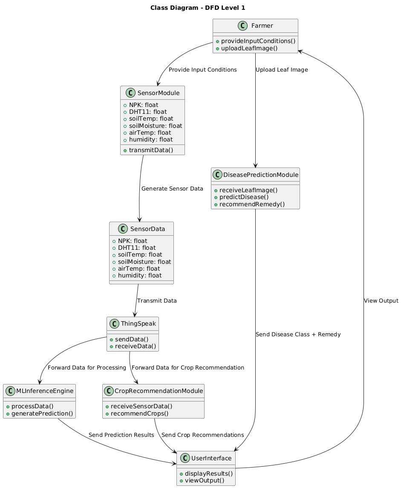
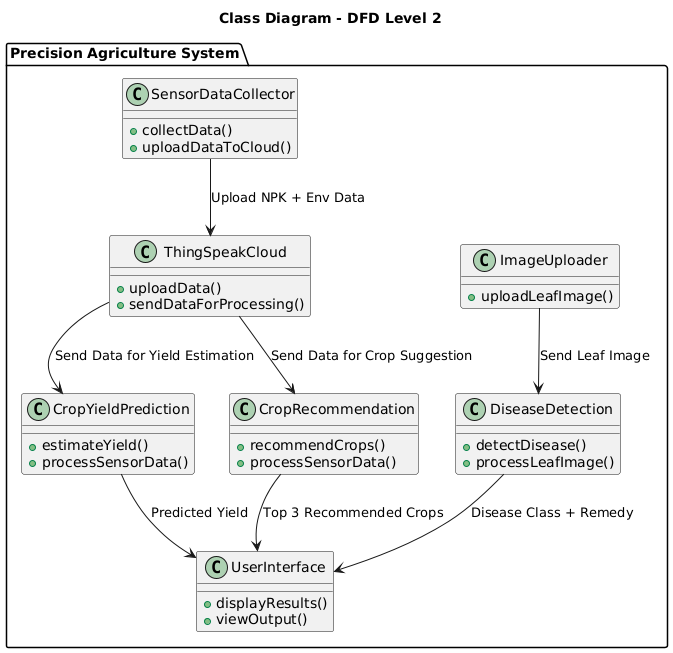
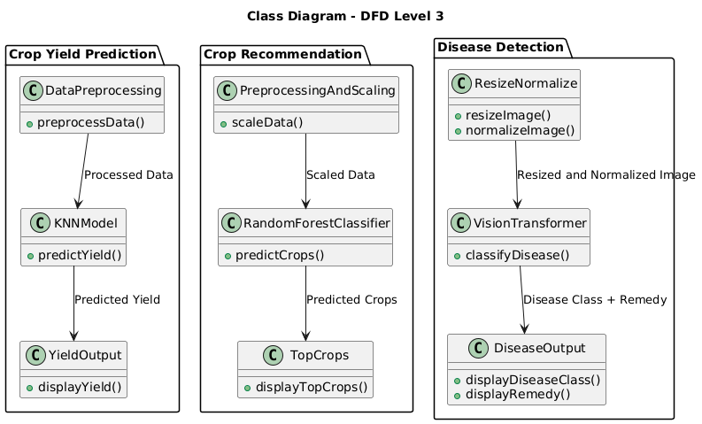
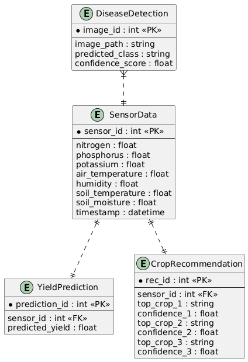
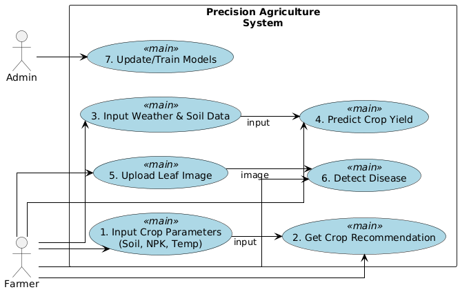
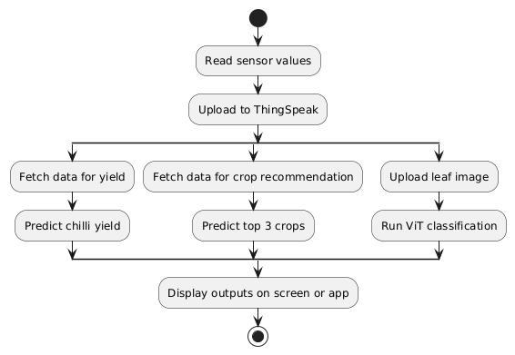
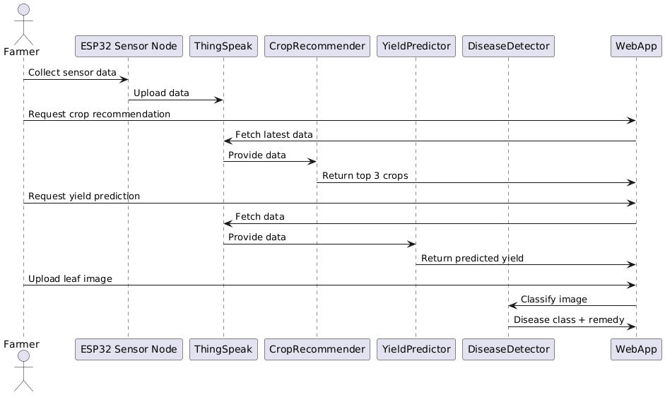

# Architecture

## System overview


Data moves in one direction, from soil to browser:

```
7-in-1 NPK probe ──RS485──┐
                          ├──► ESP32 ──WiFi──► ThingSpeak ──► Flask API ──► React
DHT11 ────────────────────┘                     (cloud)      (3 models)    (browser)
        ▲
        └── 10 W solar panel → charge controller → 18650 pack
```

| Layer | Responsibility |
|---|---|
| **Sensing** | ESP32 polls the Modbus soil probe and DHT11, samples every few seconds |
| **Transport** | HTTP GET to the ThingSpeak REST API over Wi-Fi |
| **Storage** | ThingSpeak channel, one field per measurement |
| **Inference** | Flask loads the three trained models and serves JSON predictions |
| **Presentation** | React SPA with Firebase authentication |

The three models are independent and share no state, which is why each could be developed and swapped without touching the others.

## Context diagram



## Module breakdown



## Integrated workflow



## Entity relationships



## Use cases



## Activity flow



## Sequence



## Design notes

**Why three separate models rather than one.** The three questions have different input shapes — tabular nutrients, tabular time-series, and images — and different users. Keeping them independent meant the disease model could be retrained on a GPU without disturbing a working recommendation endpoint.

**Why inference is server-side.** The ESP32 has neither the memory nor the floating-point throughput to run a Vision Transformer. Predictions run on a server; the node's job ends at publishing a reading.

**Why ThingSpeak.** It gave free time-series storage, a REST API and hosted charting, which removed the need to build and operate a database for a student project. The tradeoff is a hard dependency on a third-party service — and that dependency is exactly what failed: the channel is now retired, and the visualisation page that embedded it no longer renders.

**What the architecture got wrong.** The node had no local buffering, so connectivity gaps meant permanently lost readings. A queue in flash, drained on reconnect, would have cost little and saved data.
